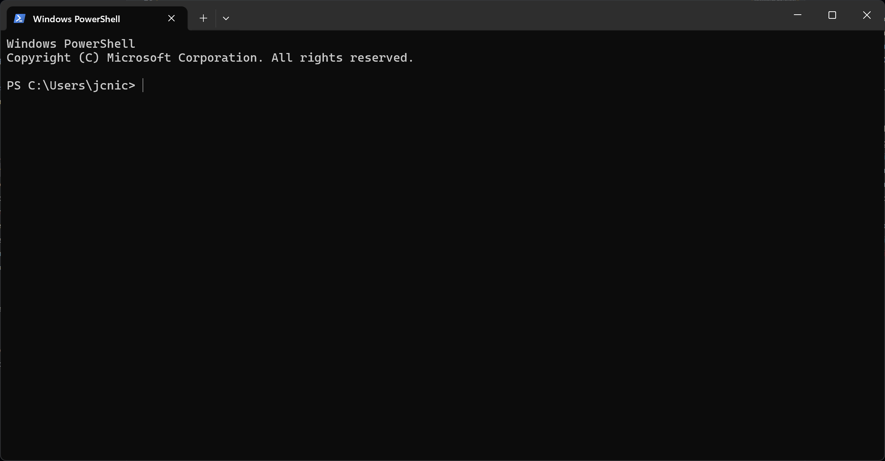
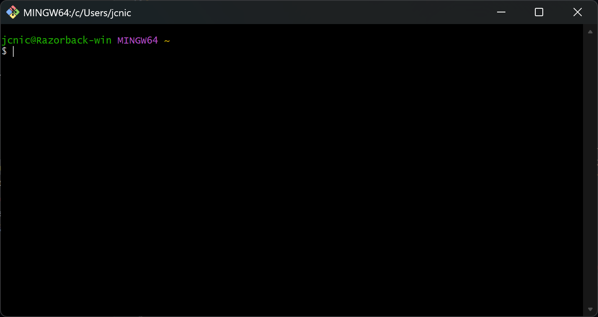
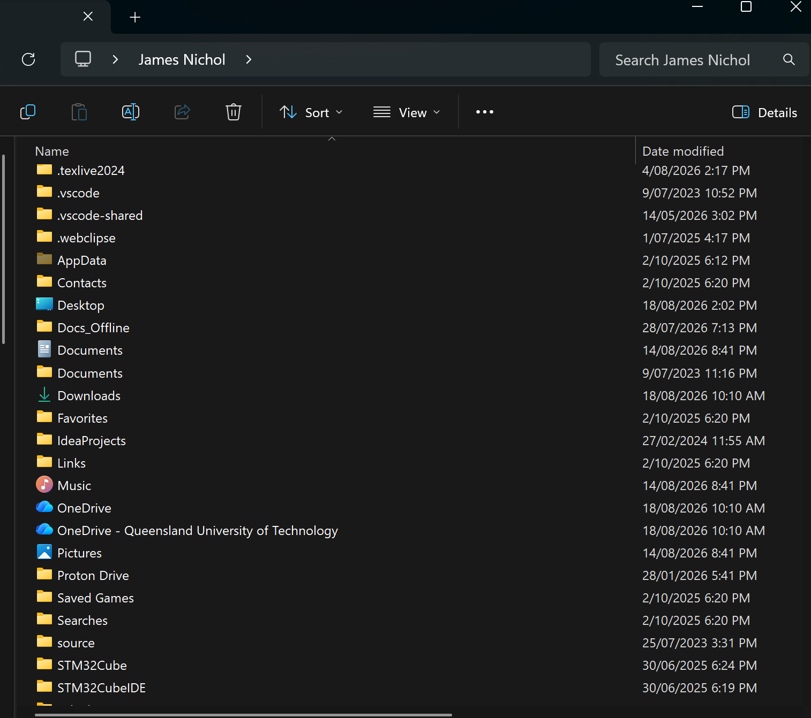

# Command Line Basics

This lesson will take you through the basics of navigating and using the terminal and command line, preparing you to use version control systems and other advanced tooling later in the semester.
These skills are fundamental to navigating and interacting with modern software projects.

## What is it?

A command line interface (or *CLI*) is a text-based interface which allows you to directly interact with your computer instead of using graphical windows.
It's a core part of almost all software development, since:

- Many tools operate primarily through the command line (`git`, `cmake`, `gcc`, ...)
- All scripts (which includes most automation) run in the terminal
- It's faster than a GUI for a lot of operations!

!!! info "Terminology"
    The terms *terminal*, *shell*, and *CLI* are often used interchangeably to refer to "the thing you enter text comands into".
    However, they technically do refer to different things.
    The *CLI* is the actual interface you interact with - it's the line on which you enter your commands!
    The *shell* is the text-based program which provides the CLI and parses, executes, and displays commands and information.
    Examples include Command Prompt (`cmd.exe`), PowerShell, Bash, `sh`, `zsh`, and more.
    Finally, the *terminal* is the graphical display in which the *shell* runs - and sometimes they're the same program, just to make things more confusing!

| Operating System | Default Shell                             |
| ---------------- | ----------------------------------------- |
| Windows          | PowerShell (or sometimes Commmand Prompt) |
| Linux            | Usually Bash, sometimes `zsh`             |
| MacOS            | Z shell (`zsh`)                           |

## How do we run it?

### Windows

#### Start Menu (recommended)

Open the start menu by pressing ++win++ and type "Terminal" - it comes preinstalled on modern Windows versions and will open PowerShell.
If that doesn't work, you can also search for "PowerShell", "Command Prompt", or "cmd.exe" to launch a shell directly.

!!! warning
    We recommend using PowerShell instead of Command Prompt, as it is a much better shell and behaves better.

#### Run Menu

Alternatively, you can launch the exact executables directly.

1. Press ++win+r++ to open the Run menu
2. Type either `powershell.exe` or `cmd.exe` and press ++enter++.
3. PowerShell or Command Prompt should now launch!

### MacOS

#### Applications

Go to your Applications folder and run the Terminal app.

#### Launcher

Press ++cmd+space++, type `terminal.app`, and press enter.

### Linux

Launching a terminal may vary between distros, but usually pressing ++ctrl+alt+t++ will bring one up.
Alternatively, on most "standard" distros you can usually press ++super++ to bring up a search menu.
In this case, just search "terminal" - some of the most common options you're likely to see include Konsole, GNOME Terminal, LXTerminal (on Raspberry Pis), Alacritty, or kitty.
If ++super++ doesn't bring up a search menu, try ++super+space++ or ++super+r++ - if none of these work, I assume that you have enough knowledge of your particular distro to launch a terminal anyway.

## What's all this?

Now that you should have a basic terminal open, let's go over how to use it.
Where your cursor is blinking is called the *prompt* - it's where your typed commands live.
To its left or above it will be your *current working directory* (CWD), which is the directory the shell currently has "selected".
This is equivalent to navigating to that directory in your file explorer of choice: If you create things, run programs, or rename/move items, it is all relative to that directory, just like in a graphical browser.



For example, in the PowerShell screenshot shown above, the CWD is `C:\Users\jcnic`.
All terminals will open to your "home directory" by default, which varies by OS.
In Windows, this will almost always be shown as its full path, but in Linux and Unix-like systems like MacOS, it is usually abbreviated to `~` instead[^git-bash].

[^git-bash]: The one normal exception to this is Git Bash on Windows - it will show your home directory as `~` to keep consistency with Linux shells.

| OS      | Shorthand       | Example Full Path | Display Path     |
| ------- | --------------- | ----------------- | ---------------- |
| Windows | `%userprofile%` | `C:\Users\jcnic`  | `C:\Users\jcnic` |
| MacOS   | `~`             | `/Users/james`    | `~`              |
| Linux   | `~`             | `/home/james`     | `~`              |

On Linux, you might see something more similar to this:



Here, in addition to the current directory (`~`), the prompt also includes login details - that being your username and machine hostname.

However, they are all equivalent to opening that directory in Explorer like so:



!!! info "Home Directories"
    On all operating systems, your home directory is the folder that contains the locations you probably normally interact with, such as Documents, Desktop, Downloads, Photos, and so on.
    You can see some of them in the screenshot above!

## Basic Navigation

### Changing Directory

!!! note
    This lesson uses forward-slash path notation: `folder1/folder2`, as this is what Linux and MacOS use.
    However, Windows uses backslash notation: `folder1\folder2`.
    This is incompatible with Linux-style shells, whereas forward-slash is compatible with Windows.

The first part of using the terminal is basic navigation.
In all shells, this is done using the `cd` command (short for **c**hange **d**irectory).
After typing out your command, press ++enter++ to execute it.
For example, if the current directory contains a directory named `Projects`, you can navigate to it like so:

```bash
# navigate to Projects directory
cd Projects
```

And you can go straight to subdirectories too:

```bash
# navigate to robots101 inside the Projects directory
cd Projects/robots101
```

To go back *up* a directory level, use `..`, which means "the folder above this one".
For example, if you were in the `Projects/robots101` subdirectory, this would go back up one level to `Projects`:

```bash
# Go back up one directory level
cd ..  
```

Or, again being executed from `Projects/robots101`, you can chain it together like any other folder name:

```bash
# Go back up two directory levels (to the original path)
cd ../..

# Or to a sibling directory:
cd ../robots102
```

However, this command will fail if the folder you're trying to navigate to contains spaces or special characters:

```bash
# This will fail!
cd Another Directory/
```

To navigate into these directories, you must surround the path with single (or double) quotes:

```bash
# This works with special characters!
cd 'Another Directory/'
```

All the directories so far have been _relative_ to your current location.
You can also use *absolute* paths, which are relative to the file system root:

Linux-style:
```bash
cd /home
```

Windows:
```powershell
cd C:\Users
```

### Showing Current Location and Contents

Although most shells show your current path in the prompt, sometimes you just want to know your current location, such as to expand abbreviations like `~`, for use in scripting, or if the terminal just doesn't show it.
This is the job of the `pwd` command (short for **p**rint **w**orking **d**irectory):

```bash
# print out the current working directory
pwd
```

And to list out the contents of your current directory:

```bash
ls
```

!!! warning
    `ls` is the default directory listing program on Linux and MacOS, but not Windows.
    In PowerShell `ls` will work (somewhat), but not in Command Prompt.
    On Windows, the `dir` command is the closest alternative:
    ```powershell
    dir
    ```
    Substitute `dir` anywhere you see `ls` if you are using Command Prompt.

Additionally, if you want to list the contents of a specific directory instead of your current one, you can do that too:

```bash
ls Projects/robots101
```

And of course it works with both relative and absolute paths too.

## Making and Moving Things

To make a directory from the CLI, you use the `mkdir` command (**m**a**k**e **dir**ectory):

```bash
mkdir Projects
```

This will create a folder in your CWD, just like creating a new folder from your file explorer.
However, it can't create parent directories:

```bash
# This won't work on Linux and MacOS!
mkdir Projects/robots101
```

!!! note
    Windows does automatically create parent folders by default using `mkdir`!

For that, you need to add the `-p` *flag* (meaning create parent directories):

```bash
# This creates both the Projects and Projects/robots101 directories
mkdir -p Projects/robots101
```

Once you've created things, you might also want to *move* things!
This is done using the `mv` command (**m**o**v**e):

```bash
mv from_path to_path
```

And this works for both files and directories, though it is worth noting that you can't move things to nonexistent directories.

### Removing Things

!!! danger
    Deleting things from the command line has no undo!
    Make sure you know what you're doing, as you can easily break things.
    Your OS will probably try to put some guard rails in place, but if you ignore them, you can do serious damage.

#### Linux/MacOS

On Linux and MacOS, your primary way of deleting things is the `rm` (**r**e**m**ove) command:

```bash
rm path_to_file
```

However, this doesn't work on directories!
For that, you need to add the `-r` (recursive) flag:


```bash
rm -r path/to/directory
```

## Exit Codes

All programs, once they exit (either of their own volition, or By the Power of Task Manager) return what's called an _exit code_ or _return code_.
This is a (usually) positive integer which gives some information about how the program exited.
The default, 0, means the program exited successfully! (Hopefully. Some programs lie.)
Anything else means some form of error, or more rarely, a warning.
Exit code 1 is a fairly generic "catch-all" for just "something went wrong", and there are a couple of other common ones for the standard ways programs can be externally terminated, but most programs using will provide a list of potential codes in their documentation if they use this mechanism.
This is normally used in automated scripts, as it allows programs to commmunicate whether or not a process succeeded, so that the script can either terminate there or perform some form of error handling.